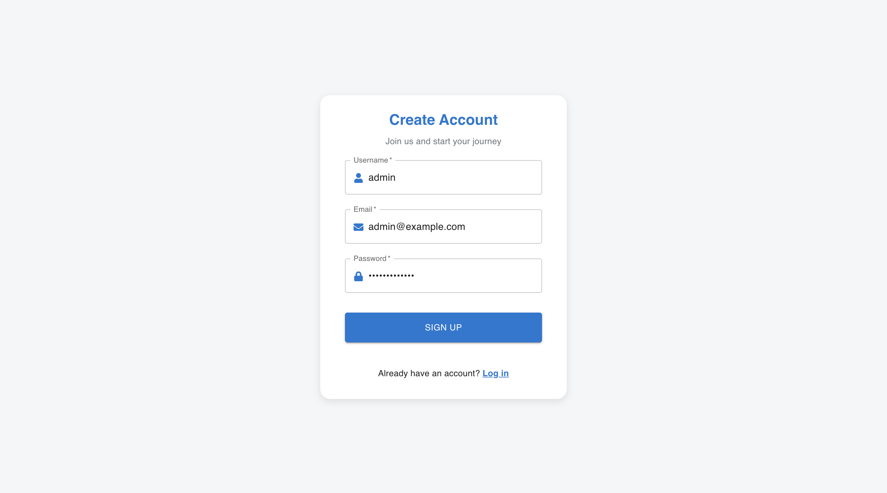
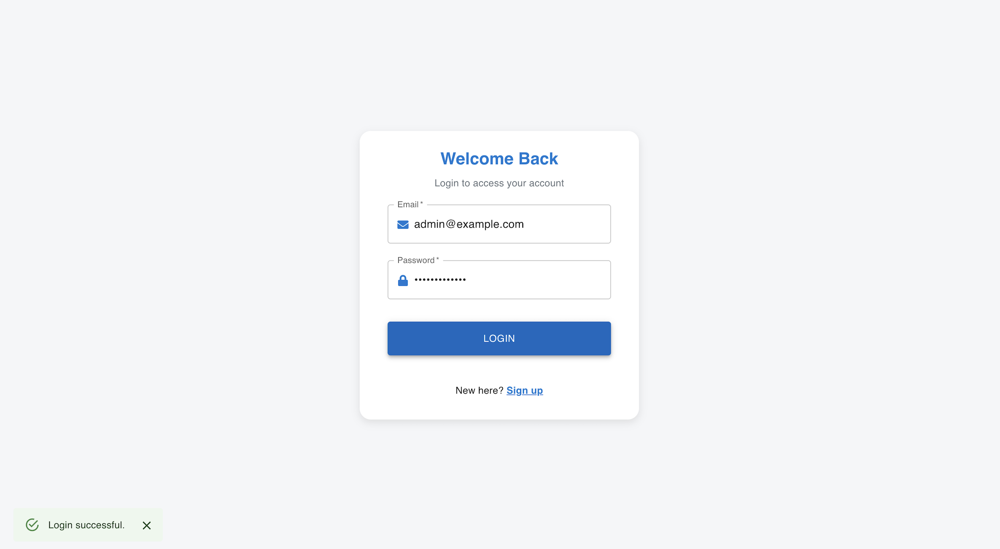
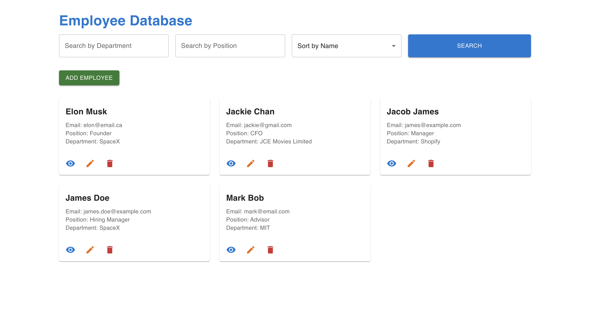
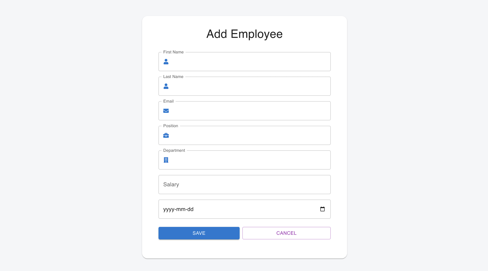
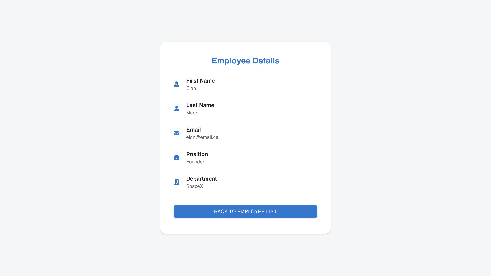
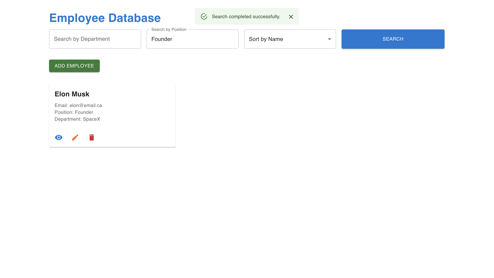
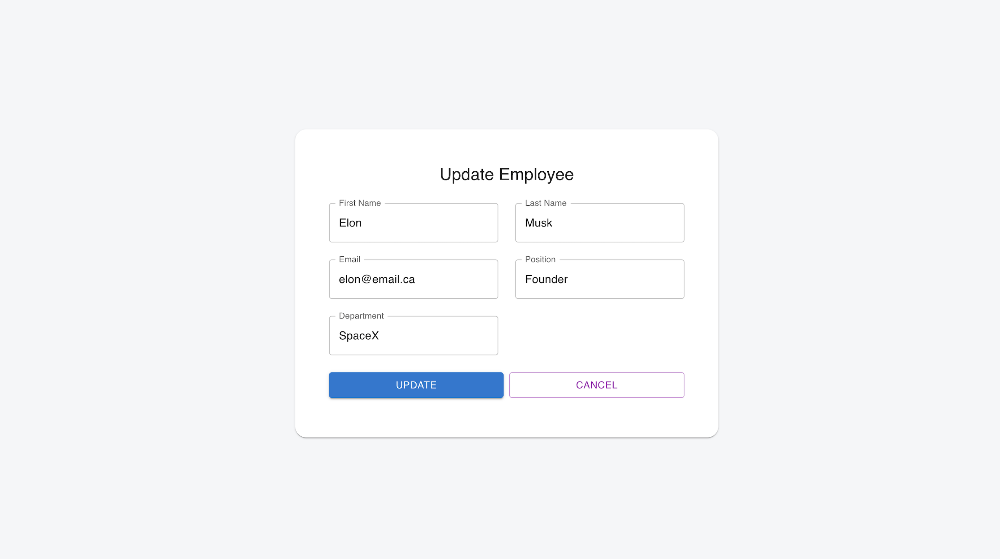
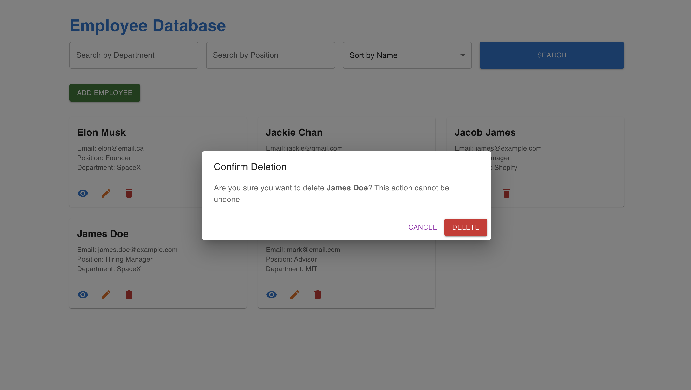

# Employee Management System

The **Employee Management System** is a web application designed for managing employee data with user authentication. It features a clean, responsive UI for seamless employee record management.

---

## Key Features

- **Add, Update, Delete Employees**: Easily manage employee records.
- **Search & Filter**: Search employees by department or position.
- **User Authentication**: Signup and login with secure JWT-based authentication.
- **Responsive Design**: Optimized for all devices.

---

## Screenshots

### Signup Page

### Login Page

### Employee List

### Add Employee

### View Employee Details

### Search Employee

### Update Employee

### Delete Employee

---

## Tech Stack

- **Frontend**: React.js, Material-UI
- **Backend**: Node.js, Express.js, MongoDB
- **DevOps**: Docker & Docker Compose

---

For additional details or troubleshooting, check the comments in the code.

---
